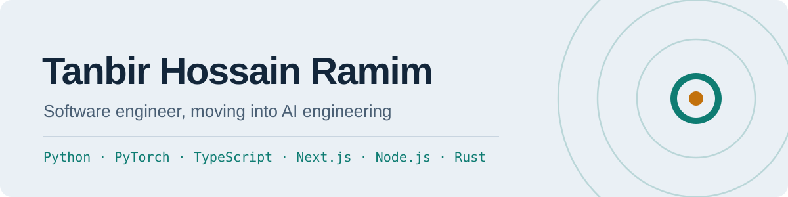

<picture>
  <source media="(prefers-color-scheme: dark)" srcset="assets/banner-dark.svg">
  
</picture>

Software engineer in Regensburg, studying Computer Science at **OTH Regensburg** and moving into **AI engineering**. I build things the world needs, from real-time voice systems to cutting neural network training compute.

  
  
  
  
  
  

**Currently:** Student Assistant at OTH Regensburg, building a real-time conversational voice AI. Open to **Werkstudent** roles in software and AI engineering.

### Featured projects

| Project | What it is |
| --- | --- |
| [**callm**](https://github.com/TanbirRamim/callm) · [PyPI](https://pypi.org/project/callm-toolkit/) | Production toolkit for LLM calls: caching, retries, provider fallback, cost tracking, PII redaction, prompt-injection detection and structured output in one decorator. |
| [**EnAi**](https://www.tanbirramim.com/projects/enai) · [enai-lab.com](https://www.enai-lab.com/) | Runtime PyTorch training optimizer: hook-driven layer freezing and adaptive batch sizing. 6.91% of training compute removed on ResNet-18, verified by autograd. |
| [**Open Source Radar**](https://github.com/TanbirRamim/open-source-radar) | Unclaimed, beginner-friendly issues from active projects by language and topic, refreshed every 12 hours, plus a contribution guide. |

### Merged open source contributions

| Project | Fix |
| --- | --- |
| [OpenAPI Generator](https://github.com/OpenAPITools/openapi-generator) (26k stars) | [Kotlin: correct default values for inline enum array parameters](https://github.com/OpenAPITools/openapi-generator/pull/24940) |
| [oh-my-posh](https://github.com/JanDeDobbeleer/oh-my-posh) (23k stars) | [Read custom language tools from YAML configs](https://github.com/JanDeDobbeleer/oh-my-posh/pull/7870) |
| [oapi-codegen](https://github.com/oapi-codegen/oapi-codegen) (8.6k stars) | [Strict server: delegate JSON marshalling for allOf unions and additionalProperties](https://github.com/oapi-codegen/oapi-codegen/pull/2552) |
| [Powertools for AWS Lambda (Python)](https://github.com/aws-powertools/powertools-lambda-python) (3.3k stars) | [Event handler: match generic alias response models in the OpenAPI schema](https://github.com/aws-powertools/powertools-lambda-python/pull/8453) |

More in review at uutils/coreutils, npm/cli, zellij, fyne, pmd, svgo, datasette and others.

### Writing

- [How to find good first issues that are still open in 2026](https://www.tanbirramim.com/writing/how-to-find-good-first-issues)
- [How I built VoiceMax: reading emotion from a voice recording with three small AI flows](https://www.tanbirramim.com/writing/how-i-built-voicemax)
- [How I built FaceTube: browser video calls, twice](https://www.tanbirramim.com/writing/how-i-built-facetube)
